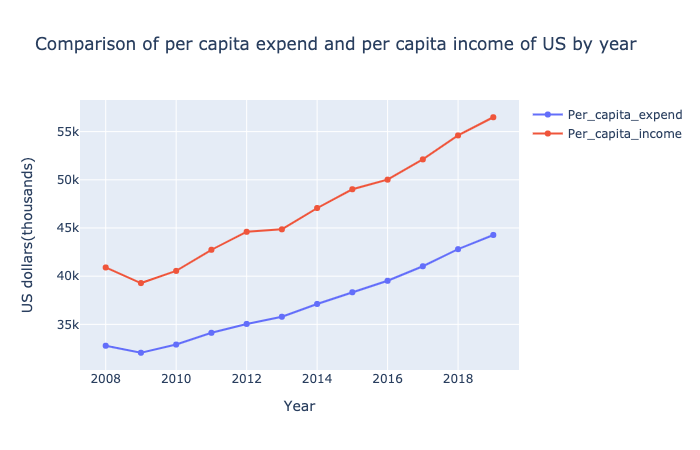
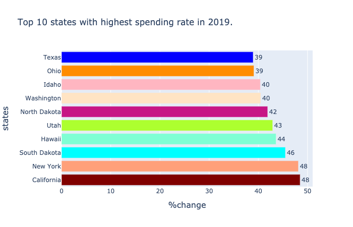
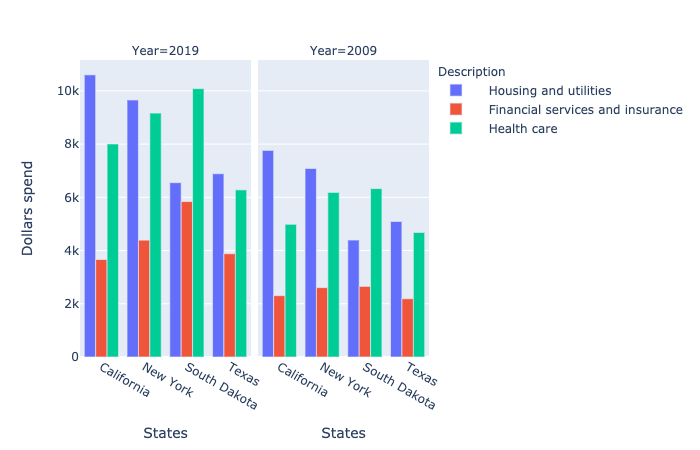

# Analysis of spending and inflation

After we have analysed the personal income, now we can head up for analyzing spending pattern. The analysis of spending pattern is significant as it  point out towards the inflation and as well
as consumer spending pattern. While comparing spending pattern to income, it is essential for policy makers to see if inflation is effecting people adversely. It tells us out
if people are able to save some money. 

Keeping this in mind, lets compare the per capita expenditure of US to per capita income of US over the years. Per capita income means average income made each person and per capita expenditure 
means average amount of money spended by each person.

From the comparison, you can see that per capita expenditure is increasing in same pattern like the per capita income. From 2008 t0 2018 and more, both per capita income and expenditure are increasing
with same slope. Today's per capita expenditure was equal to 2012's per capita income. This means that the amount of per person spending has been significantly increased. However, because of the parallel increase in per capita income,
there does not seem to be adverse effect. And the gap between these lines are showing that each person have been saving some amount of money. This can help the policy makers to control the market price accordingly.

So after national comparison, I would like to see which state has increased their spending rate and by how much from 2008 to 2019. So lets see the plot.

This horizontol bar plot shows California people have increased their spending rate by 40%. In same way, even other states are not that far away. This can lead to a point that though inflation have surged abundantly, 
increase in each person's people income in all these states have maintained the economy market.

Through some data filter,  we realized that the top areas where people are spending most money seems to happen Housing and utilities, health care and financial services and insurance.
Furthermore, to have more clarity, we can see the following plot which compares the spending behavior of Top 4 state residents in 2009 and in 2019. Among all, **housing and utilites** seems to be 
the most expendable area for these 4 states (and even for other states) in both 2009 and 2019 as well.

From this analysis, we can shed some light that per person in most of all states have top priority to spend in housing and utility, health care and financial services and insurance.
That is why affordable health care and affordable health care is always the biggest question.

Now, coming with this conclusion, let's specifically narrow down our topic to housing and utility. In other words, living and rental cost and move in our [next section](RPP.md)
