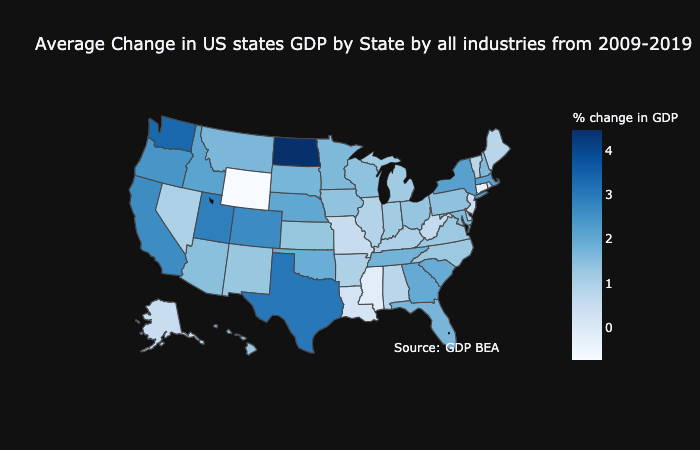
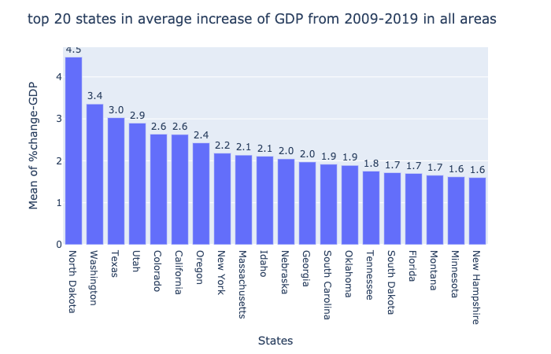
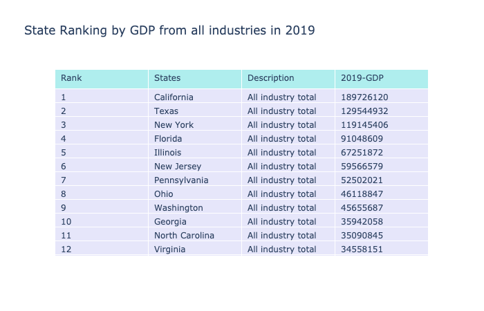
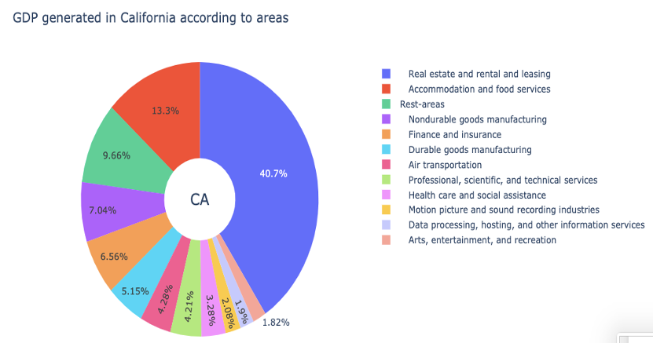

## Analysis of GDP 

To start with the visualization, first I would like to see GDP of all 50 states and DC.And actually see how are have they increased their GDP from 2009 to 2019. In this regard, first I would like to see these 50 states including DC with their GDP change.

Click [link](https://github.com/ujjoli/Individual-Project/blob/gh-pages/Individual%20Project%2002.ipynb) to see the full code.

```
fig = go.Figure(data=go.Choropleth( #using graph objects
    locations=GDP_state_df_change_Plot['state_name'], # Spatial coordinates
    z = GDP_state_df_change_Plot['Mean of %change-GDP'].astype(float), # Data to be color-coded
    locationmode= 'USA-states', # set of locations match entries in locations
    colorscale = 'Blues',
    colorbar_title = "% change in GDP",
    hoverinfo='location+z'
))

fig.update_layout(  #update figure's layout proporties 
    title_text = 'Average Change in US states GDP by State by all industries from 2009-2019 ',
    geo_scope='usa', # limite map scope to USA
    template='plotly_dark'
)

fig.show()
```



This plot shows 50 states GDP showing North Dakota being has highest chagne of GDP from 2009 to 2019. This tells us that compared to other states North Dakota's GDP has increased more than any other states. Now let's look a closer look to see, which states make top 20 in the list in bar plot.

```
#plotting top 20 states in average increase of GDP from 2009-2019
fig = px.bar(Top_20_states_df, y='Mean of %change-GDP', x='States', text='Mean of %change-GDP') #plotly bar function
fig.update_traces(texttemplate='%{text:.2s}', textposition='outside')
fig.update_layout(uniformtext_minsize=8, uniformtext_mode='hide',title_text = 'top 20 states in average increase of GDP from 2009-2019 in all areas')
fig.show()
```



The bar plot indicates the same thing where North Dakota is the top state and is followed by Washington, Texas, Utah and California. 

Here, GDP of the state is the sum of total contribution in that state from different areas or industries. Deeping into, lets just compare the GDP in 2019 and see which state is top growing state just in 2019. 

```
fig_tab = go.Figure(data=[go.Table(  #calls graph objects of plotly in tabular form
    header=dict(values=['Rank','States','Description','2019-GDP'],
                fill_color='paleturquoise',
                align='left'),
    cells=dict(values=[all_state_2019.Rank,all_state_2019.States, all_state_2019.Description, all_state_2019['2019']],
               fill_color='lavender',
               align='left'))
])
fig_tab.update_layout(  #update figure's layout proporties 
    title_text = 'State Ranking by GDP from all industries in 2019 '
)

fig_tab.show()
```



So, from the table it becomes clear that California is in top of the table, being followed by Texas, New York and Florida. Now, we know that California is at top state with highest GDP, let's see which industries in California are contributing to its GDP. In other words, lets see which indusrty is most growing industry in California.



```
# plotting data in plotly pie-chart

lab =top_industry_CA_lim['Description']
val = top_industry_CA_lim['2019']

# Use `hole` to create a donut-like pie chart
fig = go.Figure(data=[go.Pie(labels=lab, values=val, hole=.3)])

fig.update_layout(
    title_text="GDP generated in California according to areas",
    # Add annotations in the center of the donut pies.
    annotations=[dict(text='CA', x=0.5, y=0.5, font_size=20, showarrow=False)])
fig.show()

#Real estate and rental leasing is top industry among other industries that contribute more.
```

From this dought-not shaped pie-chart , we can see that to rank California as the top state in GDP, Real state, rental and leasing is contributing significantly more than any other industries. 40% of its GDP is coming from real estate, leasing and industry. This is significantly huge !!. This indicates that businesses related to real estate might be sky rocketing and there might be a good chance that many people are employed in this area in California. 

Now let's move to our [second part of analysis](Income.md)
