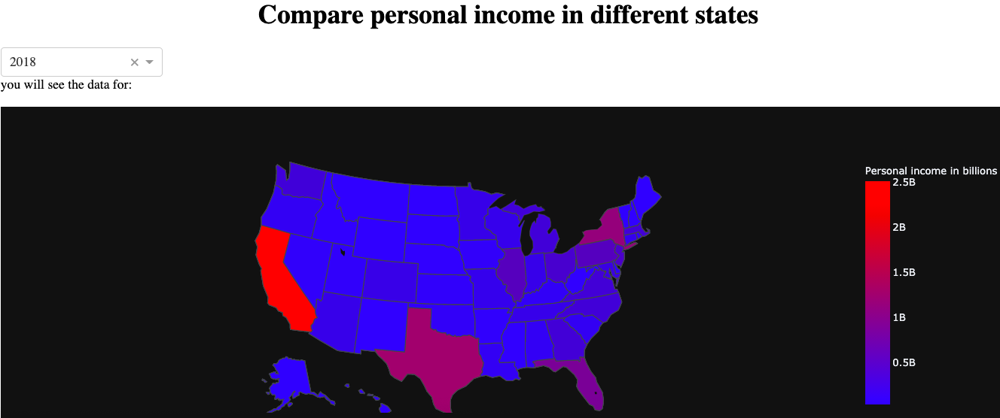
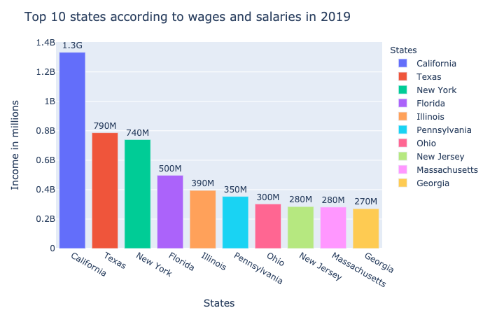
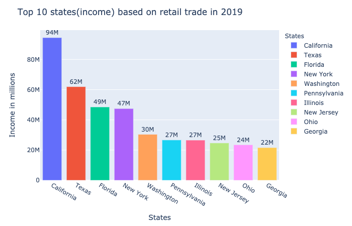
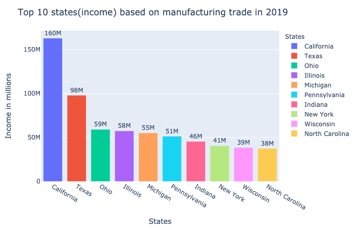
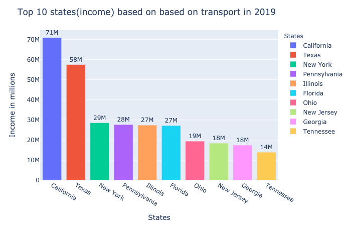
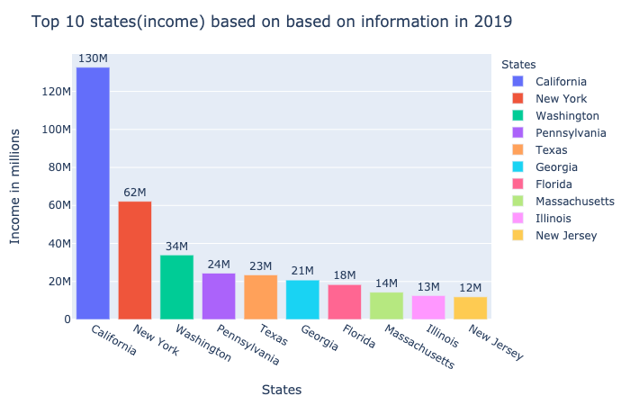
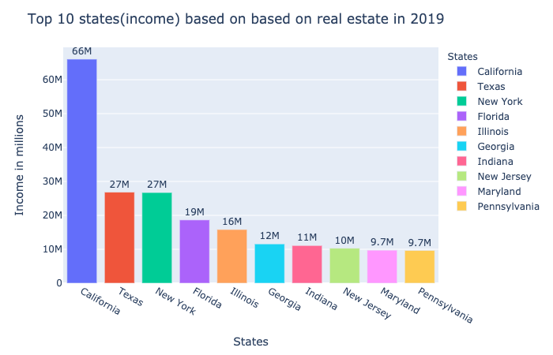
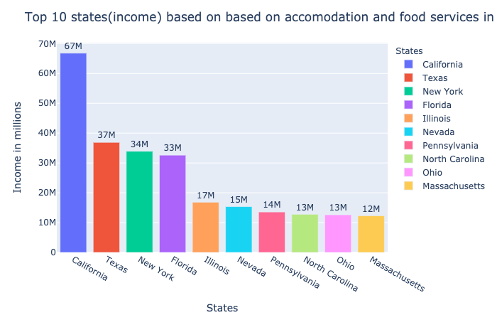
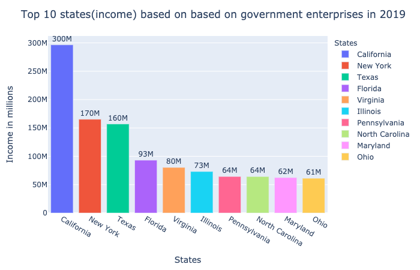

# Income Analysis

After analyzing GDP by state, let's analyze Income of each state and by different areas to see some patterns. First of all, let's see how the income is varied by state to state.So let's compare the income of all 50 states for many yeaars and come back to 2019. 

We are comparing personal income by state so Lets see the plot. The plot shows that over time the personal income has been increasing in all states and people are being able to bring more paycheck to home. 

Click[here](https://github.com/ujjoli/Individual-Project/blob/gh-pages/Individual%20Project%2002.ipynb) for full code.



This plot just gives the idea of how the income is varied by state to state. To have deeper sense, we are acutually going to see the income by different areas, so let's look bar plot.

```
# looking for states with high wages and salaries
comp_wage_sal = compare_states(y=' Wages and salaries')
draw_plot(df = comp_wage_sal,a='2019',x='States',title = 'Top 10 states according to wages and salaries in ')
```




This plot compares the income made by each state on basis of wages and salaries. In other words, this plot shows those people whose income is earned from typical wages and salaries,and compares it to top 10 states. Even in this plot you see California has higher personal income than other states in terms of wages and salaries. Having said that it is important to remember that Califronia had Real state area to generate its top industry. California is followed by Texas New York and Florida.

Now, lets analyze other area which is retail trade. So on the retail trade too, you will see California dominating all other states followed by Texas and New York

```
# calling function to compare income based on retail trade to other states
comp_retail_trade = compare_states(y= '   Retail trade',)
draw_plot(df = comp_retail_trade,a='2019',x='States',title = 'Top 10 states(income) based on retail trade in ')
```



Now comparing manufacturing area, you will see the same pattern where California stays at the top.

```
# calling function to compare income based on manufacturing to other states
comp_manufacturing = compare_states(y= '   Manufacturing')
draw_plot(df = comp_manufacturing,a='2019',x='States',title = 'Top 10 states(income) based on manufacturing trade in ')
```



Similarly, even if you compare in transport area, you will see similar pattern, but you can notice the difference between states have been reduced for trasnportation area.
```
# calling function to compare income based on transport to other states
comp_transp = compare_states(y= '   Transportation and warehousing')
draw_plot(df = comp_transp,a='2019',x='States',title = 'Top 10 states(income) based on based on transport in ')
```



Now another area we would like to see is information. The following plot shows that California dominates all other states and the disparity between the states rises.
```
# calling function to compare income based on information to other states
comp_info = compare_states(y= '   Information')
draw_plot(df = comp_info,a='2019',x='States',title = 'Top 10 states(income) based on based on information in ')
```



Similarly, same pattern goes for real estate. Not only in GDP, even in personal income the California is top of the all.
```
# calling function to compare income based on real estate to other states
comp_real_estate = compare_states(y= '   Real estate and rental and leasing')
draw_plot(df = comp_real_estate,a='2019',x='States',title = 'Top 10 states(income) based on real estate and rental and leasing in ')
```



Moreover, even for the accomodation and food service area, personal income of California is higher than other states.

```# calling function to compare income based on food and accomodation to other states
comp_food = compare_states(y= '   Accommodation and food services')
draw_plot(df = comp_food,a='2019',x='States',title = 'Top 10 states(income) based on accomodation and food services in ')
```



Finally,we have government area, and this area also follows the same pattern like other areas.
```
#calling function to compare income based on government areas to other states
comp_gov = compare_states(y= '  Government and government enterprises')
draw_plot(df = comp_gov,a='2019',x='States',title = 'Top 10 states(income) based on governemnt and govenrmnet enterprises in ')
```



So from all these comparisons, we can say that from all the areas, California residents bring back more paychaecks than any other states and are more tend to have economic well being.


With all these analysis, we can move forward to analysis of expenditure and see their consumption pattern. Along with it, we can compare income with the consumption.
so for more section, [click here](Expenditure.md)


