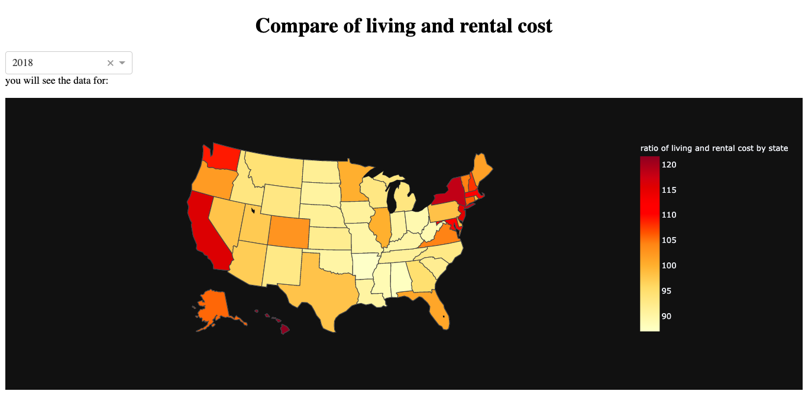
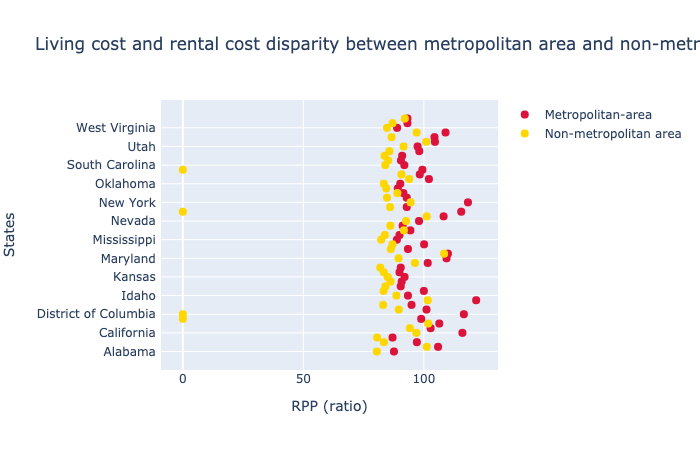

# Analysis of Relative Cost of Living and Expenses

As we came to know that housing and utility seem to be top priority of many residents, it is relevant to see which state in US have high cost of living and expenses.
Relative Cost of living and expenses is measured on RPP which is Regional Price Parity (RPP). It is an index (ratio) that sets the national average cost of goods and 
services at 100, with a particular region's RPP showing how the cost of living in that region compares to that average. 

So lets move on our analysis from following plot.

This is comparison of RPP in 2018. This plot shows that the darkest color laids on Hawii, California, Massachussets, Disctrict of Colombia and New York. They have the index more than 115 where 100 is
said to be the average. So the plot shows that Hawaii, California , Massachussets, DC and New York have highest RPP indicating they are the moest expensive place to live.
It is interesting that California has the highest spending rate, more contributed by housing and rental utility, seems to have similar pattern with RPP. This plot is not only
important to policy makers, but can also be a good indication for job seekers and people like who want to settle down. We can be convinced that, if we get job offer from
California and Alaska with equal salaries and benefits (assuming all other facilites to be similar) and want cheaper place to live in, we have to go with job offer from
Alaska and Alabama.

In addition, there is much disparity between the metropolitan area and non-metropolitan area. Metropolitan area are expensive than non-metropolitan area. This can
also be shown from following figure.

With all these findings, now lets move on our [last section](comparison.md)
