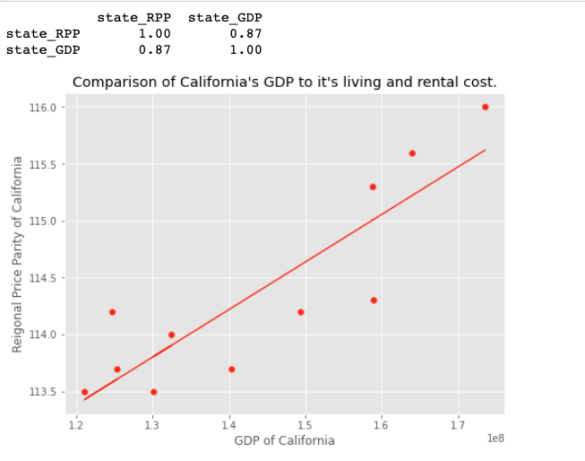
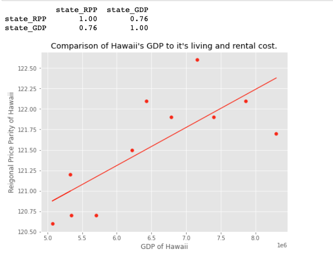
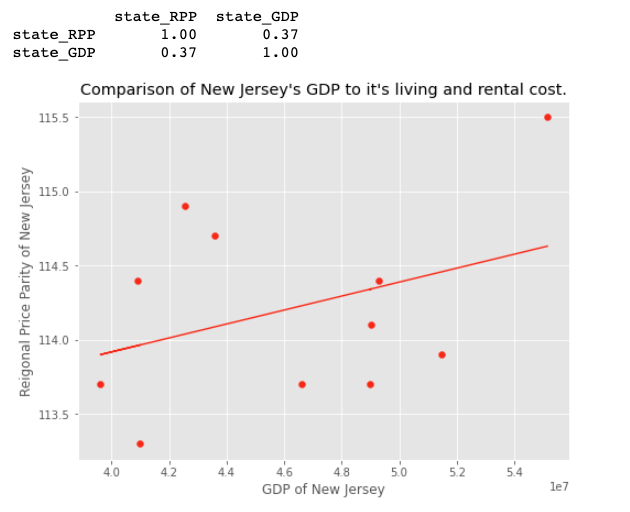

# Co-relation between GDP and RPP

Finally, I would like to see if there is any effect of GDP to RPP. As GDP by state shows which area in that state is blooming, RPP expresses the index of cost
of rental cost and living cost. I would like to see if increase in GDP of that state will increase RPP of that state. In other words, will GDP growth of that state 
make the place or the state expensive to live in.

Let's get the **co-relation for California**:

Click the [link]() to see the full code.

```
get_corelation_value(state_GDP,states_Rpp)       #finding co-relation
calc_regression(state_gdp=state_GDP, state_rpp = states_Rpp, states= 'Hawaii')
```


Using the stats library, I have calculated the regression line and plot it the chart. So the chart shows that the co-relation seems to be pretty high and positive 
between GDP of state and RPP of the state, which means increase in GDP can have increase in living and rental cost of California.

Similarly, **comparing for Hawaii**

```
get_corelation_value(state_GDP,states_Rpp)       #finding co-relation
calc_regression(state_gdp=state_GDP, state_rpp = states_Rpp,states = 'New York')
```





This plot shows that Hawaii's GDP and Hawaii's RPP have co-relation value of 0.7 which means that they also have strong and positive relation.


However, if we compare **New Jersey's** 

GDP with NJ's RPP, the co-relation seems to be weak

```
get_corelation_value(state_GDP,states_Rpp)       #finding co-relation

calc_regression(state_gdp=state_GDP, state_rpp = states_Rpp, states='New Jersey')
```




So from above analysis we can conclude that just the GDP of state might not be enough to co-relate with state's RPP. There might be other factors they come in play.

